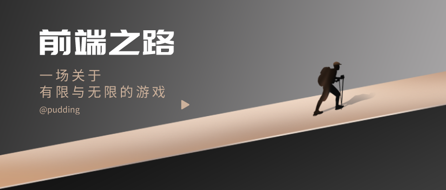

# 前言


因 gitbook 编辑器体验过于糟糕，目前准备弃坑转向 Notion（4.21）


## 关于我

一名大三在读学生，目前在做前端开发相关工作。

平时用到的语言绝大多是都是JavaScript \( TypeScript \)，开发经验以小程序居多。

我给这本 Gitbook 小书的定位为`笔记类`，主要是为了帮助建立起自己的知识体系，同时记录一些小的点，便于日后的回顾与思考，如果小书中的内容能够帮到你，或者对你有启发，那就更好了。

## 推荐







## 想法

热爱生活，信仰技术

## 联系我

对本书有任何疑问，欢迎联系我。

   
[https://github.com/bdingtech](https://github.com/bdingtech)

## 其他

### 排版

笔记内容按照 [中文文案排版指北](https://github.com/sparanoid/chinese-copywriting-guidelines/blob/master/README.zh-CN.md) 进行排版，以保证内容的可读性。

## 版权许可

本作品采用[知识共享署名-非商业性使用 4.0 国际许可协议](http://creativecommons.org/licenses/by-nc/4.0/)进行许可，只要保持原作者署名和非商用，您可以自由地阅读、分享、修改本书

> 大部分人类都是很悲催的动物，你比他强一点，对方会羡慕你；你比他强很多，对方会嫉妒你；你比他强很多很多，对方就会仰慕你。
>
> 有时候这种感觉没有人能了解 我暗自哭泣却不知道为了什么 这里的生活把我变得盲目 我凝视着却看不到自己的灵魂 这是一段很长很长的旅程 用尽所有的时光永无止境 我不停地奔跑、呼喊和追寻 在我的路上寻找生命的意义 ——《 我的路 》
>
> You Deserve A Better Life.

