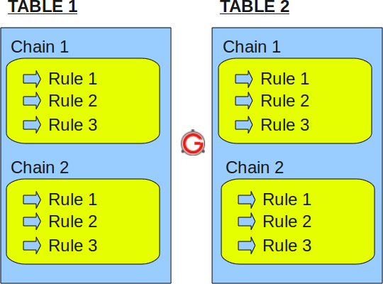

# iptables & 防火墙 基础知识

## **一、iptables 的表与链**

**规则表：**

1.filter表——三个链：INPUT、FORWARD、OUTPUT  
作用：过滤数据包  内核模块：iptables\_filter.  
2.Nat表——三个链：PREROUTING、POSTROUTING、OUTPUT  
作用：用于网络地址转换（IP、端口） 内核模块：iptable\_nat  
3.Mangle表——五个链：PREROUTING、POSTROUTING、INPUT、OUTPUT、FORWARD  
作用：修改数据包的服务类型、TTL、并且可以配置路由实现QOS内核模块：iptable\_mangle\(别看这个表这么麻烦，咱们设置策略时几乎都不会用到它\)  
4.Raw表——两个链：OUTPUT、PREROUTING  
作用：决定数据包是否被状态跟踪机制处理  内核模块：iptable\_raw  
\(这个是REHL4没有的，不过不用怕，用的不多\)

**规则链：**  
1.INPUT——进来的数据包应用此规则链中的策略  
2.OUTPUT——外出的数据包应用此规则链中的策略  
3.FORWARD——转发数据包时应用此规则链中的策略  
4.PREROUTING——对数据包作路由选择前应用此链中的规则  
（记住！所有的数据包进来的时侯都先由这个链处理）  
5.POSTROUTING——对数据包作路由选择后应用此链中的规则  
（所有的数据包出来的时侯都先由这个链处理

#### 

